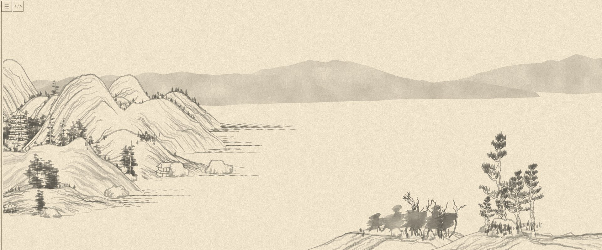
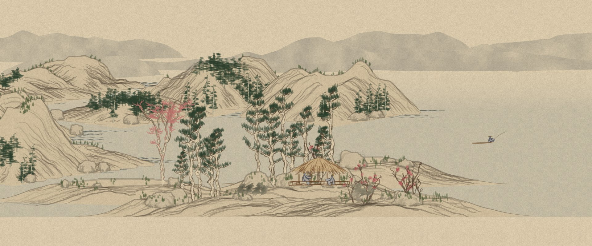
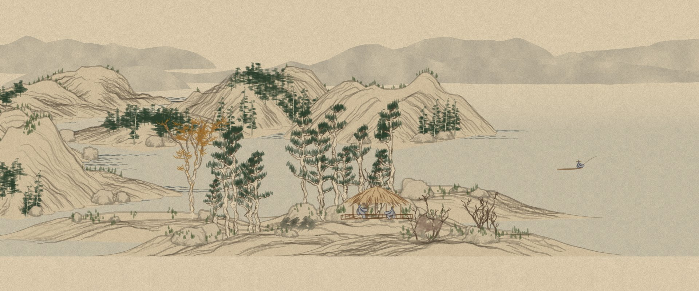
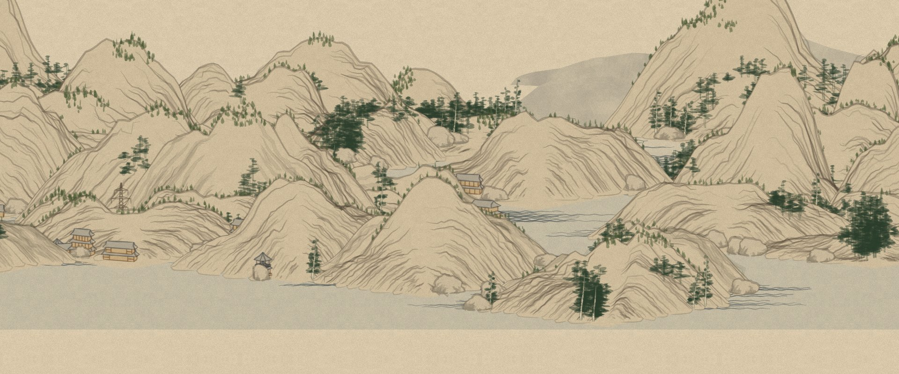

# Shan Shui Wallpaper

An ambient desktop wallpaper version of **[{Shan, Shui}\*](https://github.com/LingDong-/shan-shui-inf)** by [Lingdong Huang](https://github.com/LingDong-), made for [Lively Wallpaper](https://github.com/rocksdanister/lively).

All credit for the landscape generator goes to the original project. Its code in `index.html` is unchanged; this repository only adds a wallpaper layer on top of it (`index_wallpaper.html`).

## Original vs. wallpaper

Both screenshots use the same seed (`?seed=7`), so you can compare the same landscape.

**Original** (`index.html`): grey ink on light paper, scrolled by hand



**Wallpaper** (`index_wallpaper.html`): coloured ink wash, cropped to fill the screen, drifts slowly on its own



The same spot in the three seasonal zones (cherry blossom, summer, autumn):

| Cherry blossom | Summer | Autumn |
| --- | --- | --- |
|  |  |  |

A mountain-heavy stretch (`?seed=42`):



## What we changed

Everything lives in `index_wallpaper.html`: a copy of `index.html` with one extra `<style>` block and one extra `<script id="AMBIENT">` block appended. The generator functions themselves (mountains, trees, buildings, water, the planner) are untouched; the new script only wraps them and recolours their SVG output.

**Display**
- The menu, the source button and the left/right scroll arrows are hidden, and the page no longer scrolls.
- The landscape is scaled to the full screen height. The view is cropped slightly at the top (`VIEW_TOP`) so it fills a 16:9 screen.
- Resizing the window (for example switching Lively to "span across monitors") re-crops the view, so it works across several monitors.

**Motion**
- Instead of clicking the arrows, the camera drifts slowly and endlessly to the right (`SPEED`, default 2.2 SVG units per second).
- New sections are generated ahead of the camera, and sections far behind it are dropped so memory stays flat.
- After Lively pauses the wallpaper (e.g. when a fullscreen app is open), it continues where it left off instead of jumping.

**Landscape**
- Long empty lake stretches get extra mountains: the original planner runs as before and only gets additional entries added to its plan (`FILL_MOUNT`, `FILL_DIST`).

**Colour**
- A warmer, more muted paper tone (`PAPER_TONE`, multiplied onto the original paper texture).
- Each element gets its own ink colour instead of grey (`PALETTE`): stone-coloured mountains, blue-grey distant mountains and water lines, green pines and moss, wooden buildings and boats with slate roofs, blue robes and straw hats for the figures.
- A faint blue tint on open water (`WATER_TINT`).
- Only pure grey values are recoloured, so the shading and stroke structure of the original stay the same.

**Seasons**
- The drift passes through three zones that repeat: cherry blossom, summer and autumn (`BIOMES`). Each zone is about two screen widths long and blends into the next.
- Depending on the zone, leafy trees and bushes turn pink, green, ochre or red, and gnarled bare trees get soft plum blossoms on their upper branches.
- Seasonal colours and blossoms use their own random numbers, so they never change the shape of the landscape.

**Other files**
- `LivelyInfo.json`: project metadata so Lively can load the folder as a web wallpaper.
- `index_wallpaper_*.html`: earlier versions, kept as backups.

## Usage

Copy `index_wallpaper.html` and `LivelyInfo.json` into a folder in Lively's wallpaper library and set it with:

```
Lively.exe setwp --file "<that folder>"
```

All settings (speed, crop, colours, seasons) are at the top of the `AMBIENT` script in `index_wallpaper.html`. For testing, a few URL parameters are available:

| Parameter | Effect |
| --- | --- |
| `?seed=7` | fixed landscape instead of a new one on every load |
| `?speed=40` | faster drift |
| `?biome=0` / `1` / `2` | stay in one season (cherry blossom / summer / autumn) |
| `?color=0` | original grey ink and paper, no seasons |
| `?fill=0` | no extra mountains in empty stretches |

## License

Licensed under the MIT License of the original project (see `LICENSE`).

---

*Original README:*

# {Shan, Shui}*
Procedurally-generated vector-format infinitely-scrolling Chinese landscape for the browser.
Generate your own on https://lingdong-.github.io/shan-shui-inf/ (or [Alternative link](https://shan-shui-inf.glitch.me)).

Some examples:


{Shan, Shui}\* is inspired by [traditional Chinese landscape scrolls](https://en.wikipedia.org/wiki/Shan_shui) (such as [this](https://en.wikipedia.org/wiki/Dwelling_in_the_Fuchun_Mountains) and [this](https://en.wikipedia.org/wiki/Wang_Ximeng)) and uses noises and mathematical functions to model the mountains and trees from scratch. It is written entirely in javascript and outputs Scalable Vector Graphics (SVG) format.
